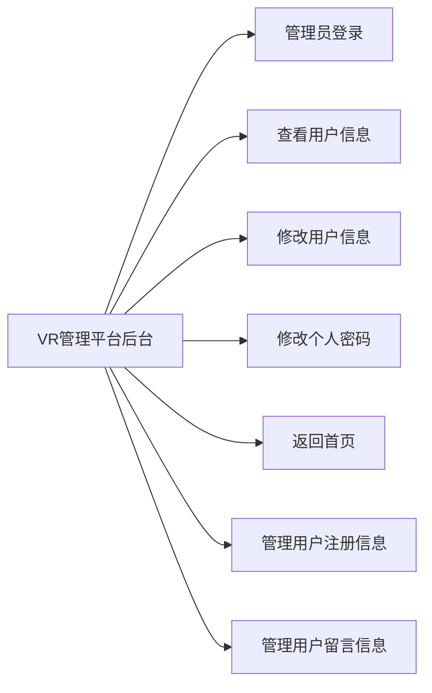
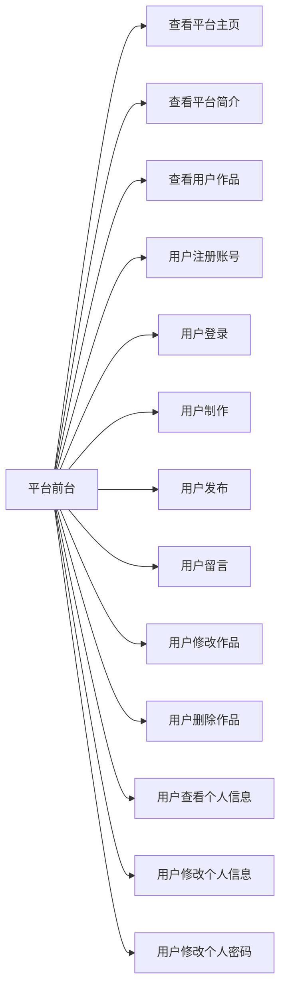

#
绪论

&emsp;&emsp;随着计算机技术的高速发展，虚拟现实已经不是一个遥不可及的梦了。现在通过很多技术都能实现。当年的电视机，到现在的全民上网。随着4G时代的到来带动了，短视频行业。那么5G时代的到来将带动更多的行业，首当其冲就是VR产业。此项目是一个VR虚拟模拟平台，该平台分为前台和后台主要包括：网站的简介查看功能、用户创作自己的虚拟产品功能、用户管理功能、作品分类功能、用户注册功能、用户登录功能、用户留言功能、管理员登录功能、个人信息查看修改功能、个人密码修改功能、搜索删除作品功能、搜索修改作品简介功能、提取用户注册信息功能、提取用户预约信息功能、提取用户留言信息功能等。任何用户都可以在本网站查看作品预览和查看作品简介，但需要注册个人账号登陆后才可以创作和留言信息。当进入用户登录界面以后，可以浏览首页上的各种文字以及图片。当管理成功登录到后台界面以后，可以查看与修改自己的个人信息；可以修改当前个人账号密码；可以对婚纱简介信息进行新增、修改和删除，在修改和删除时也可以对婚纱简介进行搜索；可以提取用户注册账号信息，在提取账号信息后可以对无用的账号信息进行删除；可以提取用户的预约信息，在查看预约信息时可以通过搜索来判断已读预约信息和未读预约信息；在提取用户留言信息的时候可以点击查看留言的完整信息也可以对留言信息进行删除。当管理员操作完毕后，可以单击“个人信息”里面的“安全退出”选项，退出后台系统。  
# 
第一章&emsp;开发背景
  
&emsp;&emsp;近年来随着Internet的迅速崛起，互联网已经成为人们生活不可或缺的一部分。互联网已成为收集提供信息的最佳和最快渠道，并快速进入传统的流通领域。互联网的跨地域性、可交互性、全天候性使其在与传统媒体行业和传统贸易行业的竞争中具有不可抗拒的优势，因而发展十分迅速。
&emsp;&emsp;当然，无论是企业还是社会，随着信息量的增大，变化幅度也不断增大。随着信息技术的的不断发展，现在已经能用代码模拟现实。这个项目就是为了实现这个目标的。
# 
第二章&emsp;平台分析

&emsp;&emsp;因为现在的网络速度还是不是非常的快，如果把平台做成安装包的形式给用户让用户自己生成漫游上传，到平台，这样的效率是非常慢的。针对这样的问题，可以直接在平台上生成，然后直接在平台发布，这样提升了平台的运行速度。当然也增加了平台的负担。使用前台和后台相连接的平台更新替换需要发布的信息、提取需要接收的数据可以使原本复杂的工序变得简单轻松，系统将自动更新到对应的页面。本文将对720VR管理系统进行分析与总体设计。

## 2.1.平台功能描述  
&emsp;&emsp;用户注册功能、用户登录功能、用户制作功能、用户提交功能、用户留言功能、VR预览查看功能、个人简介查看功能、管理员登录功能、个人信息修改功能、个人密码修改功能、安全退出功能、简介新增功能、简介修改功能、简介删除功能、简介搜索功能、提取用户预约信息、提取用户注册信息、提取用户留言信息、用户管理等模块。具体描述如下：
&emsp;&emsp;1.用户模块：
&emsp;&emsp;&emsp;&emsp;（1）界面预览；
&emsp;&emsp;&emsp;&emsp;（2）注册账号
&emsp;&emsp;&emsp;&emsp;（3）用户登录
&emsp;&emsp;&emsp;&emsp;（4）用户留言；
&emsp;&emsp;&emsp;&emsp;（5）用户预约；
&emsp;&emsp;&emsp;&emsp;（6）查看个人信息；
&emsp;&emsp;&emsp;&emsp;（7）修改个人信息；
&emsp;&emsp;&emsp;&emsp;（8）修改个人密码；
&emsp;&emsp;&emsp;&emsp;（9）返回首页；
&emsp;&emsp;&emsp;&emsp;（10）安全退出；
&emsp;&emsp;2.简介模块：
&emsp;&emsp;&emsp;&emsp;（1）新增简介；
&emsp;&emsp;&emsp;&emsp;（2）搜索简介；
&emsp;&emsp;&emsp;&emsp;（3）修改简介；
&emsp;&emsp;&emsp;&emsp;（4）删除简介；
&emsp;&emsp;3.用户管理模块：
&emsp;&emsp;&emsp;&emsp;（1）查看用户注册信息；
&emsp;&emsp;&emsp;&emsp;（2）删除用户注册信息；
&emsp;&emsp;&emsp;&emsp;（3）查看用户留言信息；
&emsp;&emsp;&emsp;&emsp;（4）删除用户留言信息；
&emsp;&emsp;4.管理员模块：
&emsp;&emsp;&emsp;&emsp;（1）查看用户信息；
&emsp;&emsp;&emsp;&emsp;（2）删除用户；
&emsp;&emsp;&emsp;&emsp;（3）管理用户；
&emsp;&emsp;5.VR预览；
&emsp;&emsp;6.查看最VR全景分类；
&emsp;&emsp;7.查看VR全景简介；
## 2.2.平台功能模块划分  
从功能描述的内容将其分为前后台，我们根据这些功能，设计出系统的功能模块，后台功能模块如下图2-1所示。

图2-1VR管理平台后台功能模块示意图

设计前台功能模块如下图2-2所示

图2-2设计前台功能模块

## 2.3.平台流程分析  

# 
第三章&emsp;数据库设计
  
## 3.1.创建数据库  
## 3.2.数据库结构设计  
# 
第四章&emsp;平台模块的设计  

